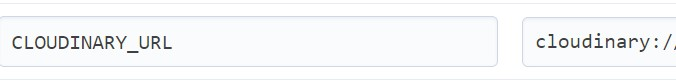

# **Clicks Backend- API**

## Table of Contents

- [Project](#project)
  * [Objective](#objective)
- [User Stories](#user-stories)
  + [Profiles](#profiles)
  + [Events](#events)
  + [Event Reviews](#EventComments)
  + [Event Rating](#EventRating)
  + [Search](#search)
  + [Posts](#posts)
  + [Post Comments](#PostComments)
  + [Post Likes](#Postlikes)
- [Technologies Used](#technologies-used)
  * [Language Used](#language-used)
  * [Frameworks, Libraries and Programs Used](#frameworks-libraries-and-programs-used)
- [Agile Workflow](#agile-workflow)
  * [Github Project Board](#github-project-board)
- [Testing](#testing)
- [Deployment](#deployment)
  * [Cloning and setting up the project](#cloning-and-setting-up-the-project)
- [Credits](#credits)

# **Project**

## Objective

Clicks Project is an app that allows user to connect with other people online or in person by joining different events shared by users. This full stack advanced front end project was created using React.js, Python, JavaScript, HTML, CSS, Django and Bootstrap.

Clicks API provides a backend database to create, view, edit and delete different items. Users can share a post, leave a comment on different posts and like post and comments. A user who wishes to share an event can upload information about the event, including the date, and a description. Other user can rate an event and also leave a comment on it. Events can be saved by users so they don't miss out on it.

The Link to the deployed API- [Deployed Project](https://clicks-api-cf3d319eca2f.herokuapp.com/)

Link to the deployed Front End project- [Deployed front end]()
Link to the Front End repository- [GitHub Repository]()

## User Stories
### Profiles

+ As a user, I can create a profile so that I can share my details and create an account
+ As a user, I can view details of my profile or other users profiles
+ As a user, I can edit details on my profile if I am logged in.
+ As a user, I can delete my profile.

### Events

+ As a user, I can create an event and share it with other users
+ As a user, I can edit events that I have created when I am logged in.
+ As a user, I can view more details for an event shared by other users and see the likes and comments on an event.
+ As a user, I can delete the event created by me.

### Event Reviews

+ As a user, I can create reviews and share it for an event
+ As a user, I can read reviews left by other users on a event
+ As a user, I can edit reviews shared by myself, if I am logged in.
+ As a user, I can delete reviews created by myself

### Event Rating

+ As a user, I can add a thumbs up reaction to an event to show my interest towards it
+ As a user, I can add a thumbs down reaction to an event to show that I am not interested or did not like an event
+ As a user, I can see the number of thumbs up and thumbs down reacts given to an event.
+ As a user, I can delete the reaction given to an event so that it is removed in the API if it was done accidently.

### Search

+ As a user, I can search for posts using keywords so I can look for specific post quicker
+ As a user, I can search for posts using categories so I can look for specific post in a certain category
+ As a user, I can search for events using keywords so I can look for a specific event quicker
+ As a user, I can search for events using category so I can look for a events in different categories
+ As a user, I can search for differnt users so that I can add my friends or people I'd like to know.

### Posts

+ As a user, I can create a new post so that I can share my post with other users
+ As a user, I can edit my post so that I can make changes to my post.
+ As a user, I can view all the posts in the post list so that I can see all the details of a post
+ As a user, I can delete my post so that I can remove it from the APi if I no longer wish to share it

### Post Comments

+ As a user, I can create comments on a post when logged in
+ As a user, I can edit a comment shared by myself
+ As a user, I can delete my own comments
+ As a user, I can view all  the comments shared by other users on a post.

### Post Likes

+ As a user, I can create a like on a post so that I can show my appreciation for it
+ As a user, I can view all the likes on a post so that I can see how many people have liked it
+ As a user, I can delete my like on a post so that I can delete it from the API

## Technologies Used
### Language Used

- Python

### Frameworks, Libraries and Programs Used

- Django
- Django RestFramework
- Cloudinary
- Heroku
- Pillow
- Django Rest Auth
- PostgreSQL
- Cors Headers

## Agile Workflow
### GitHub Project Board

I used the GitHub project board to build this project. I created different user stories to keep track of all the required components this project needed to work efficiently and meet user requirements.  This was also helpful in keeping track of all the tasks I had completed or which needed to be done.


## Testing

To view all the testing for this project, follow this [link](/TESTING.md).


## Deployment

The project was deployed to [Heroku](). A new database was created using [ElephantSQL.com](https://www.elephantsql.com/)

**Create a new database**
1. Log in to ElephantSQL to access your dashboard.
2. Click create new instance
3. Set up your plan:
  - Give your plan a name
  -  Select Tiny Turtle(free) plan
  - You can leave the tags field blank
4. Select a Region. Then select a data centre near you eg.EU-West_1 (Ireland)
5. Click Review then check that your details are correct and then click **"Create Instance"**
6. Return to the ElephantSQL dashboard and click on the **database instance name** for this project.
7. In the URL section, click the copy icon to **copy the database URL**

**Create a Heroku App**
1. Log into Heroku and go to the Dashboard, then click on **New** and then click **create new app**.
2. Give your app a name and select the region closest to you. When you’re done, click **“Create app”** to confirm.
3. Open the **Settings Tab** and then add a Config Var **DATABASE_URL**, and for the value, copy in your database URL from ElephantSQL (do not add quotation marks). It should look like this:


**Prepare project in your IDE for deployment**
1. In the **terminal**, install **dj_database_url** and **psycopg2**, both of these are needed to connect to your external database
```Python

pip3 install dj_database_url==0.5.0 psycopg2

```

2. In your **settings.py** file, import dj_database_url **underneath the import for os**
```Python

import os
import dj_database_url

```

3. Update the **DATABASES** section to the following:
```Python

if 'DEV' in os.environ:
    DATABASES = {
        'default': {
            'ENGINE': 'django.db.backends.sqlite3',
            'NAME': BASE_DIR / 'db.sqlite3',
        }
    }
else:
    DATABASES = {
        'default': dj_database_url.parse(os.environ.get("DATABASE_URL"))
    }

```

4. In your **env.py** file, add a new environment variable with the key set to DATABASE_URL, and the value to your ElephantSQL database URL
```Python

os.environ['DATABASE_URL'] = "<your PostgreSQL URL here>"

```

5. **Temporarily** comment out the **DEV** environment variable so that your IDE can connect to your external database.
```Python

import os

os.environ['CLOUDINARY_URL'] = "cloudinary://..."
os.environ['SECRET_KEY'] = "Z7o..."
# os.environ['DEV'] = '1'
os.environ['DATABASE_URL'] = "postgres://..."

```
6. In the terminal, **-–dry-run your makemigrations** to confirm you are connected to the external database.
```Python

python3 manage.py makemigrations --dry-run

```
7. If you are, you should see the **‘connected’** message printed to the terminal
8. Migrate your database models to your new database
```Python

python3 manage.py migrate

```
9. Create a superuser for your new database
```Python

python3 manage.py createsuperuser

```
10. In the **terminal** of your IDE workspace, install **gunicorn**
```Python

pip3 install gunicorn django-cors-headers

```
11. Update your **requirements.txt**
```Python

pip freeze --local > requirements.txt

```
12. Create a **Procfile** and inside the Procfile add these two commands:
```Python

release: python manage.py makemigrations && python manage.py migrate
web: gunicorn clicks_api.wsgi

```
13. In your **settings.py** file, update the value of the **ALLOWED_HOSTS** variable to include your Heroku app’s URL
```Python

ALLOWED_HOSTS = ['localhost', '<your_app_name>.herokuapp.com']

```
14. Add corsheaders to INSTALLED_APPS
```Python

INSTALLED_APPS = [
    ...
    'dj_rest_auth.registration',
    'corsheaders',
    ...
 ]

```
15. Add **corsheaders middleware** to the TOP of the **MIDDLEWARE**
```Python

 SITE_ID = 1
 MIDDLEWARE = [
     'corsheaders.middleware.CorsMiddleware',
     ...
 ]

```
16. Under the MIDDLEWARE list, set the ALLOWED_ORIGINS for the network requests made to the server with the following code:
```Python

 if 'CLIENT_ORIGIN' in os.environ:
     CORS_ALLOWED_ORIGINS = [
         os.environ.get('CLIENT_ORIGIN')
     ]
 else:
     CORS_ALLOWED_ORIGIN_REGEXES = [
         r"^https://.*\.gitpod\.io$",
     ]

```
17. Enable sending cookies in cross-origin requests so that users can get authentication functionality
```Python

 else:
     CORS_ALLOWED_ORIGIN_REGEXES = [
         r"^https://.*\.gitpod\.io$",
     ]

 CORS_ALLOW_CREDENTIALS = True

```
18. To be able to have the front end app and the API deployed to different platforms, set the **JWT_AUTH_SAMESITE** attribute to **'None'**. Without this the cookies would be blocked
```Python

 JWT_AUTH_COOKIE = 'my-app-auth'
 JWT_AUTH_REFRESH_COOKE = 'my-refresh-token'
 JWT_AUTH_SAMESITE = 'None'

```
19. Remove the value for SECRET_KEY and replace with the following code to use an environment variable instead
```Python

SECRET_KEY = os.getenv('SECRET_KEY')

```
20. Set a NEW value for your SECRET_KEY environment variable in env.py, do NOT use the same one that has been published to GitHub in your commits
```Python

os.environ.setdefault("SECRET_KEY", "CreateANEWRandomValueHere")

```
21. Set the DEBUG value to be True only if the DEV environment variable exists. This will mean it is True in development, and False in production
```Python

DEBUG = 'DEV' in os.environ

```
22. Comment DEV back in env.py
```Python

 import os

 os.environ['CLOUDINARY_URL'] = "cloudinary://..."
 os.environ['SECRET_KEY'] = "..."
 os.environ['DEV'] = '1'
 os.environ['DATABASE_URL'] = "postgres://..."

```
23. Ensure the project requirements.txt file is up to date. In the IDE terminal of your DRF API project enter the following
```Python

pip freeze --local > requirements.txt

```
24. Go back on the Heroku dashboard for your app, open the **Settings** tab, and add two mor Config Vars:
- SECRET KEY and CLOUDINARY_URL




25. Open the **Deploy** tab and in **Deployment** method section, select **Connect to GitHub**
26. Search for your Repo and then **Deploy Branch**. Your app should then be up and running!

### Cloning and setting up the project
Steps to clone and set up this project:
1. In this repository, click on the code tab.
2. Once you click on the tab, click on local and copy the URL.
3. Use an IDE and open Git Bash. Change the directory to the location where you want the cloned directory to be made.
4. Type **git clone** and then paste the URL that you copied from GitHub.
5. To get the project working, install requirements, which will download all the dependencies.
```Python

pip3 install -r requirements.txt

``` 
6. Set up the **env.py** file but make sure you add it to **.gitignore** so that the contents of your env.py file stay hidden and aren't pushed to GitHub.
7. Make sure all the changes have been migrated and you should be okay to run the project.

## Credits

- Images were taken from [Pexels](https://www.pexels.com/)
- The project was inspired by the [code institute](https://learn.codeinstitute.net) back-end DRF_API. After taking ideas from the DRF_API I created my own events section which contains a different model and review section. Because of the lack of time and starting a new job, I wanted to keep the project simple and related to something I had learnt and enjoyed creating. I liked the walk-through project and wanted to create my social media page with a something different, so I added an event section.